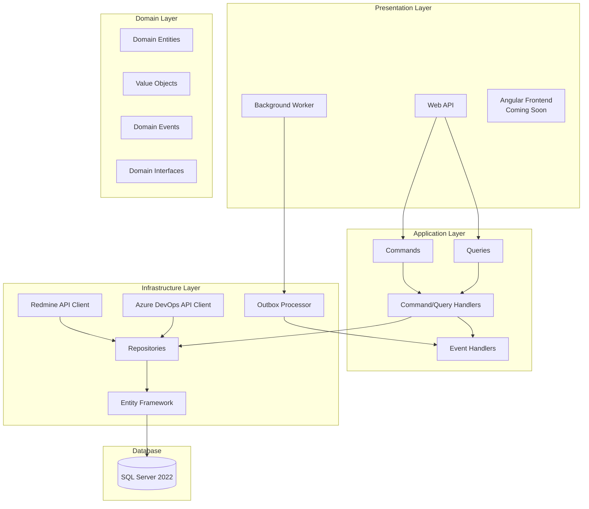
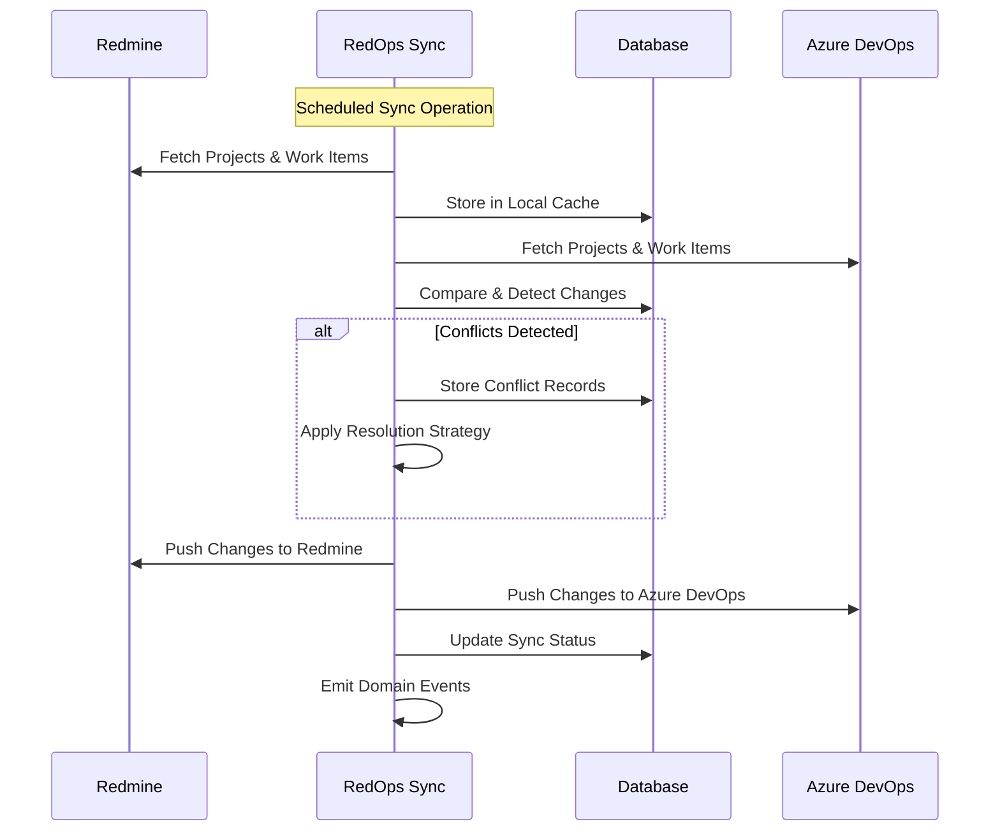
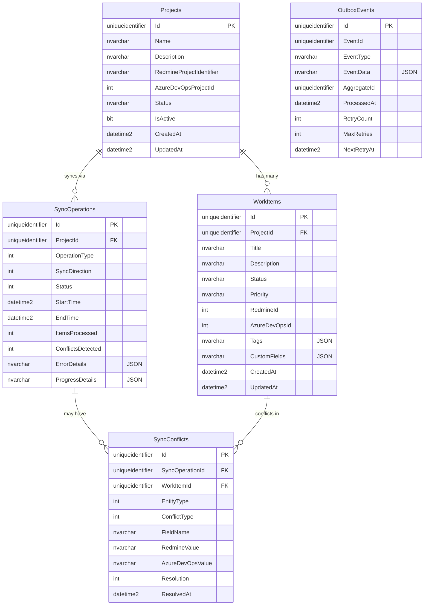

# RedOps

A comprehensive synchronization platform for bidirectional integration between Redmine and Azure DevOps, enabling seamless project management and issue tracking across both systems.

## 🏗️ Architecture Overview

RedOps follows Clean Architecture principles with clear separation of concerns:



## 🔄 Synchronization Flow



## 📊 Database Schema



## 🚀 Features

### Core Synchronization
- **Bidirectional Sync**: Projects, work items, comments, and attachments
- **Real-time Updates**: WebSocket notifications for sync progress
- **Conflict Resolution**: Intelligent conflict detection and resolution strategies
- **Incremental Sync**: Efficient delta synchronization to minimize API calls
- **Batch Processing**: Bulk operations for large datasets

### Reliability & Performance
- **Outbox Pattern**: Guaranteed event processing and delivery
- **Retry Logic**: Exponential backoff with circuit breaker patterns
- **Rate Limiting**: Respectful API consumption with configurable limits
- **Caching**: Multi-level caching for optimal performance
- **Health Monitoring**: Comprehensive health checks and metrics

### Integration Features
- **Pull Request Linking**: Automatic linking between PRs and tickets
- **Custom Field Mapping**: Flexible field mapping between systems
- **Status Synchronization**: Maintain workflow consistency
- **User Mapping**: Identity synchronization across platforms
- **Webhook Support**: Real-time event processing from external systems

## 🛠️ Technology Stack

### Backend
- **.NET 9.0**: Latest framework with native AOT support
- **Entity Framework Core 9.0**: Modern ORM with advanced features
- **SQL Server 2022**: Enterprise-grade database
- **Hangfire**: Background job processing
- **SignalR**: Real-time communication
- **Serilog**: Structured logging
- **Polly**: Resilience patterns

### Architecture Patterns
- **Clean Architecture**: Clear separation of concerns
- **CQRS**: Command Query Responsibility Segregation
- **Mediator Pattern**: Using Mediator library with source generators
- **Outbox Pattern**: Reliable event processing
- **Repository Pattern**: Data access abstraction

### External Integrations
- **Redmine REST API**: Full integration with Redmine systems
- **Azure DevOps REST API**: Complete Azure DevOps integration
- **TFS SDK**: Legacy TFS system support

## 📋 Prerequisites

- .NET 9.0 SDK
- SQL Server 2022 (Express/Developer/Standard)
- Visual Studio 2022 or VS Code
- Redmine instance with API access
- Azure DevOps organization

## 🔧 Installation & Setup

### 1. Clone Repository
```bash
git clone https://github.com/cmxl/RedOps.git
cd RedOps
```

### 2. Database Setup
```bash
# Restore database from DACPAC
sqlcmd -S localhost -d master -Q "CREATE DATABASE RedOpsDB"
SqlPackage.exe /Action:Publish /SourceFile:src/RedOps.Database/bin/Debug/RedOps.Database.dacpac /TargetConnectionString:"Server=localhost;Database=RedOpsDB;Integrated Security=true;"
```

### 3. Configuration
```bash
# Copy configuration template
cp appsettings.template.json appsettings.json

# Edit configuration with your settings
```

### 4. Build & Run
```bash
# Restore packages
dotnet restore

# Build solution
dotnet build

# Run API
dotnet run --project src/RedOps.WebApi

# Run Worker (separate terminal)
dotnet run --project src/RedOps.Worker
```

## ⚙️ Configuration

### appsettings.json
```json
{
  "ConnectionStrings": {
    "DefaultConnection": "Server=localhost;Database=RedOpsDB;Integrated Security=true;TrustServerCertificate=true;"
  },
  "RedmineConfig": {
    "BaseUrl": "https://your-redmine.com",
    "ApiKey": "your-api-key",
    "RateLimitPerSecond": 10,
    "TimeoutSeconds": 30
  },
  "AzureDevOpsConfig": {
    "OrganizationUrl": "https://dev.azure.com/your-org",
    "PersonalAccessToken": "your-pat-token",
    "RateLimitPerSecond": 15,
    "TimeoutSeconds": 45
  },
  "SyncConfig": {
    "DefaultSyncIntervalMinutes": 30,
    "MaxRetryAttempts": 3,
    "BatchSize": 100,
    "ConflictResolutionStrategy": "Manual"
  }
}
```

## 📖 API Documentation

### Sync Operations
```http
POST /api/sync/projects/{projectId}/start
GET  /api/sync/operations/{operationId}/status
POST /api/sync/operations/{operationId}/cancel
```

### Project Management
```http
GET    /api/projects
POST   /api/projects
GET    /api/projects/{id}
PUT    /api/projects/{id}
DELETE /api/projects/{id}
```

### Work Items
```http
GET    /api/projects/{projectId}/workitems
POST   /api/projects/{projectId}/workitems
GET    /api/workitems/{id}
PUT    /api/workitems/{id}
DELETE /api/workitems/{id}
```

### Conflict Resolution
```http
GET  /api/conflicts
POST /api/conflicts/{id}/resolve
GET  /api/conflicts/statistics
```

## 🔍 Monitoring & Observability

### Health Checks
- `/health` - Overall system health
- `/health/ready` - Readiness probe
- `/health/live` - Liveness probe

### Metrics
- Sync operation success/failure rates
- API response times
- Queue depths
- Error rates by category

### Logging
Structured logging with Serilog includes:
- Request/response logging
- Performance metrics
- Error tracking with correlation IDs
- Audit trail for data changes

## 🧪 Testing Strategy

### Unit Tests
- Domain logic validation
- Business rule enforcement
- Command/Query handler testing

### Integration Tests
- Database operations
- External API integrations
- End-to-end sync workflows

### Performance Tests
- Load testing sync operations
- API endpoint performance
- Database query optimization

## 🚀 Deployment

### Docker Support
```dockerfile
# Build image
docker build -t redops:latest .

# Run containers
docker-compose up -d
```

### Azure Deployment
- Azure App Service for Web API
- Azure Container Instances for Worker
- Azure SQL Database
- Azure Key Vault for secrets

### CI/CD Pipeline
GitHub Actions workflow includes:
- Automated testing
- Security scanning
- Database deployment
- Blue-green deployment strategy

## 🔐 Security

- **Authentication**: JWT tokens with refresh mechanism
- **Authorization**: Role-based access control (RBAC)
- **API Security**: Rate limiting and request validation
- **Data Protection**: Encryption at rest and in transit
- **Audit Logging**: Comprehensive audit trail

## 🤝 Contributing

1. Fork the repository
2. Create a feature branch (`git checkout -b feature/amazing-feature`)
3. Commit your changes (`git commit -m 'Add amazing feature'`)
4. Push to the branch (`git push origin feature/amazing-feature`)
5. Open a Pull Request

## 📝 License

This project is licensed under the MIT License - see the [LICENSE](LICENSE) file for details.

## 🆘 Support

- **Documentation**: [Wiki](https://github.com/your-org/RedOps/wiki)
- **Issues**: [GitHub Issues](https://github.com/your-org/RedOps/issues)
- **Discussions**: [GitHub Discussions](https://github.com/your-org/RedOps/discussions)

---

## 📈 Roadmap

### Phase 1: Core Synchronization ✅
- [x] Basic bidirectional sync
- [x] Conflict detection and resolution
- [x] Outbox pattern implementation
- [x] RESTful API

### Phase 2: Advanced Features 🔄
- [ ] Angular 20 frontend
- [ ] Real-time dashboard
- [ ] Advanced reporting
- [ ] Webhook integrations

### Phase 3: Enterprise Features 📋
- [ ] Multi-tenant support
- [ ] Advanced security features
- [ ] Performance optimization
- [ ] High availability setup

### Phase 4: Ecosystem 🌟
- [ ] Plugin architecture
- [ ] Third-party integrations
- [ ] Mobile applications
- [ ] AI-powered insights